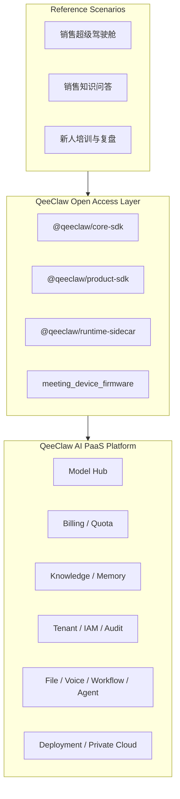

# QeeClaw SDK

QeeClaw SDK 不是一个独立产品，而是 **QeeClaw AI PaaS 平台** 的标准开放接入层。

如果用一句话概括：

**QeeClaw 负责提供企业级 AI 后端基础设施，SDK 负责把这些平台能力以标准化方式开放给业务应用、集成系统与行业方案。**

这意味着：

- `QeeClaw = AI PaaS 平台`
- `QeeClaw SDK = 平台开放层`
- `Product Apps = 基于平台能力构建的业务场景`

## 1. QeeClaw 平台与 SDK 的关系

QeeClaw 平台本身承载的是：

- 模型管理与路由
- Token / 计费 / 配额
- 知识与检索
- 记忆与上下文
- 权限、审批与审计
- 文件、语音、工作流、Agent
- 私有化部署与边缘节点能力

SDK 不负责重新定义这些能力，而是负责：

- 把平台能力按稳定协议对外开放
- 让 Web、桌面端、移动端、集成系统更容易接入
- 把通用平台能力进一步装配成场景级能力

## 2. 当前开放层结构

当前源码位于 monorepo 的 `sdk/` 目录中；如果导出为独立公开仓库，则以下内容会提升到仓库根目录。

当前开放层包含四类模块：

- `@qeeclaw/core-sdk`
- `@qeeclaw/product-sdk`
- `@qeeclaw/runtime-sidecar`
- `meeting_device_firmware`

## 2.1 对接文档入口

如果你是第一次接 QeeClaw，建议优先看这两份文档：

- `docs/QeeClaw_客户接入手册.md`
  - 面向客户、实施方、第三方研发
  - 解决“该怎么接、先接什么、最小闭环怎么跑通”
- `docs/QeeClaw_AI_PaaS平台交付手册.md`
  - 面向桌面、本地节点、边缘与私有化交付
  - 解决“客户到底要拿哪些资产、部署形态怎么选”

如果你希望直接从“客户交付目录首页”开始看，也可以先打开：

- `docs/README.md`
  - 按角色、按项目形态、按交付阶段给出阅读顺序

## 2.2 第三方接入关系速记

对外最容易讲清楚的一句话是：

`第三方系统 -> SDK / Platform API -> QeeClaw Platform -> Runtime(OpenClaw / DeeFlow2 / Others)`

这意味着：

- 第三方默认接入的是 `QeeClaw` 平台能力，不是自动把 `OpenClaw` 集成进自己的系统
- `OpenClaw` 当前是默认 runtime，但只在需要其专属能力时才会成为额外依赖
- 如果是桌面端、本地节点、边缘设备场景，才可能额外接入 `runtime-sidecar`

## 3. 四类模块的正确定位

| 模块 | 当前定位 | 在平台中的角色 |
| --- | --- | --- |
| `@qeeclaw/core-sdk` | Stable | 平台标准 API 访问层 |
| `@qeeclaw/product-sdk` | Beta | 场景 / 产品装配层 |
| `@qeeclaw/runtime-sidecar` | Experimental | 本地运行时适配层 |
| `meeting_device_firmware` | Community Preview | 硬件接入样例层 |

说明：

- 这四部分都可以公开
- 但它们的成熟度和战略地位并不完全一致
- 对外表达时，应始终强调“平台优先，SDK 从属”

## 4. 开放层分别做什么

### 4.1 Core SDK

源码路径：`sdk/qeeclaw-core-sdk`

公开仓库路径：`packages/core-sdk`

它是 QeeClaw 平台能力的标准访问层，当前主要承接：

- 计费与钱包
- 账号、AppKey 与工作空间上下文
- 模型能力
- 知识与记忆
- 设备与渠道
- 会话与治理
- 文档资产、语音、工作流与 Agent
- 审批、审计与策略

其中，当前已经完成第一轮平台能力映射：

- `billing`
- `iam`
- `apikey`
- `tenant`
- `file`
- `voice`
- `workflow`
- `agent`

下一阶段继续深化：

- `tenant / iam` 的完整控制面
- 更成熟的运行时与治理编排
- 更完整的部署与私有化交付资产

### 4.2 Product SDK

源码路径：`sdk/qeeclaw-product-sdk`

公开仓库路径：`packages/product-sdk`

它不是 UI 组件库，而是场景装配层。

它负责把多个平台域接口装配成：

- 驾驶舱
- 工作台首页
- 业务中心页
- 行业场景首页

当前它已经同时提供：

- 通用中心类 kit
- 第一样板场景 kit

**销售超级驾驶舱**

当前第一批销售场景 kit 包括：

- `salesCockpit`
- `salesKnowledge`
- `salesCoaching`

### 4.3 Runtime Sidecar

源码路径：`sdk/qeeclaw-runtime-sidecar`

公开仓库路径：`packages/runtime-sidecar`

它不是平台主体，而是本地运行时适配层。

它主要负责：

- 本地认证态同步
- 本地知识目录扫描
- 本地记忆访问
- 本地策略检查与审批缓存
- 本地 Gateway / Relay 进程托管

适合：

- 桌面 App
- 本地节点
- 私有化边缘部署

不适合：

- 纯浏览器 Web
- 纯移动端 App
- 仅云端 API 接入的 SaaS 集成

### 4.4 Meeting Device Firmware

源码路径：`sdk/meeting_device_firmware`

公开仓库路径：`hardware/meeting-device-firmware`

它是硬件接入样例层，用于说明：

- 设备如何接入平台
- 语音 / 会话能力如何落到端侧
- 边缘设备如何与平台协同

它属于平台生态样例，不代表平台主体。

## 5. 当前推荐的总体架构

## 6. 第一样板场景

QeeClaw 当前不应只做抽象平台口号，而应有一个真实牵引场景。

第一样板场景明确为：

**销售超级驾驶舱（Sales Super Cockpit）**

它将作为：

- `product-sdk` 第一批场景 kit 的承载对象
- 平台能力打磨的第一牵引应用
- 销售赋能 / 企业知识 / 新人培训三条线的统一样板

围绕这个样板场景，平台优先承接的能力包括：

- 销售知识问答
- 销售会话复盘
- 风险商机提醒
- 新人培训与复盘
- 治理、审批与计费看板

## 7. 对接建议

| 场景 | 推荐方式 |
| --- | --- |
| Web 控制台、销售超级驾驶舱 | `@qeeclaw/core-sdk` + `@qeeclaw/product-sdk` |
| Electron / Tauri 桌面应用 | 云端能力用 `core-sdk`，本地能力再接 `runtime-sidecar` |
| React Native / Expo | 优先 `core-sdk`，可按需叠加 `product-sdk` |
| iOS / Android 原生 / Flutter | 当前建议直接对接 Platform API |
| 本地节点 / 私有化边缘进程 | `runtime-sidecar` |
| 会议设备 / 硬件集成 | `meeting_device_firmware` |

## 8. 文档导航

源仓文档目录为 `sdk/docs/`，独立公开仓库对应为 `docs/`。

当前 SDK 侧提供：

## 9. 验证示例

如果你想快速验证这一套 SDK 在真实线上环境是否可用，可以直接使用：

- `sdk/examples/sales-cockpit-web-verifier/`

这是一个纯静态 Web 示例，用于验证：

- `@qeeclaw/core-sdk`
- `@qeeclaw/product-sdk`
- `salesCockpit / salesKnowledge / salesCoaching`
- `knowledgeCenter / conversationCenter / channelCenter / governanceCenter`

适合：

- 内部 smoke test
- 给客户前端团队做参考工程
- 上线前验证 `baseUrl / token / teamId / runtimeType / agentId` 是否配置正确

使用时请从仓库根目录启动静态服务，并访问：

- `http://127.0.0.1:4177/sdk/examples/sales-cockpit-web-verifier/`

如果你想直接给客户前端团队一个“能继续改业务页”的样板，则建议使用：

- `sdk/examples/sales-cockpit-starter-web/`

这个示例与 `verifier` 的区别是：

- `verifier` 更偏 SDK 连通性验证
- `starter-web` 更偏销售驾驶仓业务首页样板

- `README.md`
- `QeeClaw_客户接入手册.md`
- `QeeClaw_AI_PaaS平台交付手册.md`

维护与发布资料统一迁移到：

- `sdk/release-docs/`

治理文件：

- `CONTRIBUTING.md`
- `SECURITY.md`
- `CODE_OF_CONDUCT.md`
- `.github/ISSUE_TEMPLATE/*`
- `.github/pull_request_template.md`

在主仓中，平台侧总纲建议同时参考：

- `data/docs/架构/QeeClaw_AI_PaaS_产品定位文档.md`
- `data/docs/架构/QeeClaw_API能力清单与产品路线图.md`
- `data/docs/架构/QeeClaw_AI_PaaS平台能力总览与开放层地图_20260322.md`

交付模板目录位于：

- `deploy/README.md`
- `deploy/env/*`
- `deploy/compose/*`
- `deploy/nginx/*`

## 9. 公开发布建议

建议采用“平台统一、开放层分成熟度发布”的方式：

1. 对外首先表达 QeeClaw 是 AI PaaS 平台
2. `core-sdk` 作为主推接入层
3. `product-sdk` 作为场景装配层
4. `runtime-sidecar` 明确标记为本地运行时适配层
5. `meeting_device_firmware` 作为社区样例开放

## 10. 许可证

- 仓库根目录默认许可证：`Apache-2.0`，见 `LICENSE`
- `core-sdk`、`product-sdk`、`runtime-sidecar`：`Apache-2.0`
- `meeting_device_firmware`：`MIT`（以模块目录下的 `LICENSE` 为准）

## 11. 当前仍在推进中的事项

- 持续深化 `tenant / iam` 的完整控制面
- 将“销售超级驾驶舱”从 kit 推进到 Alpha 级参考应用
- 继续补平台控制面私有化所需的后端实现资产与运维模板
