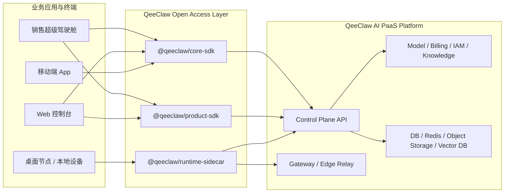

# QeeClaw AI PaaS 平台交付手册

最后更新：2026-04-08

## 1. 文档目标

本文档用于把 QeeClaw 从“可安装的 SDK”进一步提升为“可交付的平台开放层”。

它主要回答四个问题：

1. `sdk/` 当前到底能交付什么
2. 哪些内容属于开放接入层，哪些属于完整平台控制面
3. 外部团队要做 Web、桌面端、移动端或行业样板时，应该拿哪些资产
4. 第一样板场景“销售超级驾驶舱”应该如何挂到交付体系里

## 2. 交付边界

当前仓库中的 `sdk/` 可以直接交付的内容包括：

- `@qeeclaw/core-sdk`：平台标准 API 访问层
- `@qeeclaw/product-sdk`：场景 / 产品装配层
- `@qeeclaw/runtime-sidecar`：本地运行时适配层
- `meeting_device_firmware`：硬件接入样例层
- `sdk/docs/`：对外接口与接入说明
- `sdk/deploy/`：环境模板、容器示例与反向代理示例

当前不在 `sdk/` 仓内直接承载，但完整交付时必须存在的内容包括：

- 平台控制面后端
- 控制台 / BFF / 管理后台
- 数据库、缓存、对象存储、向量存储
- 实际模型密钥、租户数据与运维监控体系

因此，`sdk/` 代表的是：

**QeeClaw AI PaaS 的开放层与边缘交付样例，不是完整控制面替代品。**

## 3. 推荐交付架构



## 4. 不同交付目标的推荐组合

| 交付目标 | 推荐组合 |
| --- | --- |
| 销售超级驾驶舱 Web / 管理控制台 | `core-sdk` + `product-sdk` |
| 销售超级驾驶舱桌面版 | `core-sdk` + `product-sdk`，需要本地能力时再接 `runtime-sidecar` |
| 移动端业务 App | 优先通过平台 API 或移动端 BFF，对 JS 运行环境可复用 `core-sdk` 语义 |
| 本地节点 / 本地知识协作 | `runtime-sidecar` + Gateway |
| 边缘设备 / 会话终端 | `meeting_device_firmware` + Platform API |
| 完整私有化项目 | 主平台仓控制面 + `sdk/` 开放层 + `sdk/deploy/` 模板 |

## 5. 第一样板场景如何交付

“销售超级驾驶舱”当前被定义为：

- 第一参考业务场景
- Product SDK 第一批样板 kit 承载对象
- 平台能力闭环验证入口

推荐交付包如下：

1. 业务应用层：
   `salesCockpit`、`salesKnowledge`、`salesCoaching`
2. 平台接入层：
   `@qeeclaw/core-sdk`
3. 私有化边缘能力：
   `@qeeclaw/runtime-sidecar` + Gateway 模板
4. 文档与运维层：
   `sdk/docs/` + `sdk/deploy/`

## 6. 标准交付流程

### Step 1：确认项目拓扑

先确认当前项目属于哪一类：

- 纯云端业务应用
- 混合云 + 客户本地节点
- 桌面 App / 本地运行时场景
- 设备接入场景

### Step 2：确认开放层组合

按项目形态选择：

- 只要平台 API：`core-sdk`
- 需要场景装配：`product-sdk`
- 需要本地运行时：`runtime-sidecar`
- 需要硬件接入：`meeting_device_firmware`

### Step 3：准备控制面与存储底座

完整平台交付至少要明确：

- API 地址
- 鉴权方式
- 数据库 / Redis / 对象存储 / 向量存储
- 模型密钥与模型路由策略

### Step 4：准备边缘与网络

如果项目包含本地节点或桌面协作能力，还需要准备：

- Gateway 容器部署
- Nginx HTTPS / WSS 反向代理
- Sidecar 环境变量模板
- 本地状态目录与认证态策略

### Step 5：跑通联调与验收

建议使用以下命令做第一轮检查：

```bash
bash scripts/build-qeeclaw-sdk-stack.sh
bash scripts/verify-qeeclaw-sdk-stack.sh
bash scripts/release-qeeclaw-sdk.sh demo
bash scripts/run-qeeclaw-sidecar-healthcheck.sh
```

### Step 6：整理交付包

建议交付包至少包含：

- SDK 包与版本说明
- 对接文档
- 环境变量模板
- compose / nginx 示例
- 升级与迁移说明
- 样板场景联调说明

## 7. 当前推荐部署形态

### 7.1 全私有化控制面

适合：

- 政企客户
- 数据必须完全留在客户专网
- 需要完整租户、计费、审批、审计闭环

推荐组成：

- 平台控制面全部部署在客户私有云
- 业务应用通过 `core-sdk` / `product-sdk` 接入
- 如有本地节点，再按需部署 `runtime-sidecar`

### 7.2 混合云 + 本地边缘

适合：

- 控制面放在中心云
- 本地仍需要知识目录、设备、自主 gateway 或本地缓存

推荐组成：

- 中心云提供 Control Plane API
- 客户现场部署 Gateway / Sidecar
- 终端通过平台控制面统一收口

### 7.3 桌面本地节点与离线算力网关

适合：

- 桌面 App
- 局域网算力网关 (Edge AI Box)
- 客户个人设备上的本地知识目录
- 需要全离线本地大模型推理能力的应用

推荐组成：

- 本地部署 `QeeClaw Server (基于 hermes-agent 与 bridge_server.py)`
- 前端通过 `baseUrl` 直连本地 21747 端口
- 云端视客户意愿是否接通网络进行控制面集中授权或模型外包调用

## 8. 环境模板与部署配套

当前可直接复用的模板位于 `sdk/deploy/`：

- `env/sdk-client.env.example`
- `env/runtime-sidecar.env.example`
- `env/gateway-server.env.example`
- `env/macos-release.env.example`
- `compose/qeeclaw-gateway.compose.example.yml`
- `nginx/qeeclaw-gateway.conf.example`

模板使用原则：

- 模板文件只保留占位值
- 真实密钥、账号、证书信息必须在客户环境单独注入
- 不要把复制后的实际 `.env` 文件提交到仓库
- `runtime-sidecar` 和 gateway 的认证参数建议显式配置，不要依赖随机默认值

## 9. 安装、升级与迁移建议

### 9.1 安装建议

普通业务应用：

```bash
pnpm add @qeeclaw/core-sdk @qeeclaw/product-sdk
```

如果只需要平台 API 访问层：

```bash
pnpm add @qeeclaw/core-sdk
```

桌面端 / 本地节点如需本地协同能力，再补：

```bash
pnpm add @qeeclaw/runtime-sidecar
```

### 9.2 升级建议

建议每次升级前后都执行：

```bash
bash scripts/release-qeeclaw-sdk.sh check core product runtime
bash scripts/release-qeeclaw-sdk.sh pack core product runtime
bash scripts/release-qeeclaw-sdk.sh demo
```

### 9.3 迁移建议

从旧的本地 gateway / relay 方案迁移时，推荐顺序：

1. Sidecar 接管认证态读取
2. Sidecar 接管 `installationId`
3. Sidecar 接管设备 bootstrap
4. Sidecar 接管 gateway 进程启停
5. 本地 `memory / policy / approval` 入口统一改走 Sidecar

### 9.4 回滚建议

- SDK 包升级前先跑 `pack` 干跑
- Gateway 升级前先备份旧镜像
- Sidecar 迁移前先备份本地状态目录
- 如果新版本存在兼容问题，优先回滚到上一个已通过 `release:check` 的版本

## 10. 交付清单建议

如果你在做客户发包，建议最少交付：

- `README.md`
- `QeeClaw_客户接入手册.md`
- `QeeClaw_AI_PaaS平台交付手册.md`
- `sdk/docs/openapi/QeeClaw_Cloud_Public_API.openapi.yaml`
- `sdk/docs/postman/QeeClaw_Cloud_Public_API.postman_collection.json`
- `sdk/docs/postman/QeeClaw_Cloud_Public_API.postman_environment.json`
- `sdk/deploy/`
- 项目专属联调信息：`Base URL / API Key发放方式 / 测试账号 / 测试密码或获取方式`

如果客户只是前端项目或本地安装包 UI 项目，建议进一步收口为：

- `Base URL`
- `API Key`
- `测试账号`
- `测试密码或获取方式`

当前推荐默认口径：

- `Base URL = https://paas.qeeshu.com` (云端模式) 或 `http://127.0.0.1:21747` (本地模式)
- `API Key = sk-...` 或 `none`
- `runtimeType = openclaw` 或 `hermes`
- `teamId / agentId` 不作为客户填写参数
- 默认工作空间通过 `GET /api/users/me/context` 或 `tenant.getCurrentContext()` 自动解析

桌面端、本地节点或私有化边缘项目，再补：

- `QeeClaw Server` (含 `bridge_server.py` 与 `hermes-agent`)
- gateway 容器或部署包
- Nginx / WSS 配置
- 设备 bootstrap 与本地业务隔离沙盒策略

### 10.1 可直接发客户的标准发包清单

推荐按客户类型选择，不要默认把整个仓库都发给客户。

| 客户类型 | 必发内容 | 按需补发 |
| --- | --- | --- |
| Web / Node / TS 团队 | `docs/README`、`QeeClaw_客户接入手册.md`、公开版 OpenAPI / Postman、联调信息 | `@qeeclaw/core-sdk`、`@qeeclaw/product-sdk` |
| Java / Go / Python / PHP / 原生移动端 | `docs/README`、`QeeClaw_客户接入手册.md`、公开版 OpenAPI / Postman、联调信息 | 参数/返回样例、测试账号 |
| 桌面端 / 本地节点 | 上述全部 + `QeeClaw_AI_PaaS平台交付手册.md` + `sdk/deploy/` + `runtime-sidecar` | gateway 部署包、设备 bootstrap 策略 |
| 私有化边缘项目 | 上述全部 + `QeeClaw_AI_PaaS平台交付手册.md` + `sdk/deploy/` | 镜像、Compose、Nginx/WSS 配置 |
| 完整私有化平台项目 | 上述全部只是开放层交付的一部分 | 还需要主平台仓控制面、数据库、缓存、对象存储、向量存储、运维体系 |

### 10.2 不建议默认打给客户的内容

除非合同明确约定源码交付，否则以下内容不建议默认提供：

- `sdk/release-docs/`
- 内部发布脚本、打包脚本、验收脚本
- 内部开发计划、断点清单、历史遗留说明
- 整个前后端工程源码
- 本地构建产物、依赖目录和开发环境文件

## 11. 交付目录建议

当前建议把交付资产统一收口到两个位置：

- `sdk/docs/`
- `sdk/deploy/`

其中：

- `docs/` 负责说明“是什么、怎么接、怎么升级”
- `deploy/` 负责说明“怎么配、怎么跑、怎么交付”

## 12. 关联文档

- `sdk/docs/README.md`
- `sdk/docs/QeeClaw_客户接入手册.md`
- `sdk/docs/archive/QeeClaw_Platform_API_v1_域化接口说明_20260321.md`
- `sdk/docs/archive/README.md`
