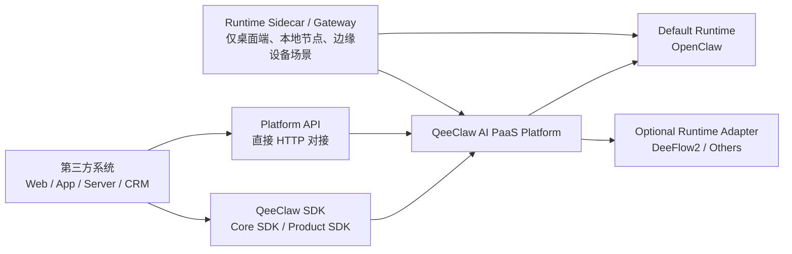

# QeeClaw 第三方 SDK 与 Platform API 对接文档

最后更新：2026-04-08

## 1. 文档目的

本文档用于给第三方团队提供一份可以直接开始对接的文档，覆盖三类接入方式：

- `Core SDK`：推荐给 TypeScript / Node / 前端团队
- `Product SDK`：推荐给需要快速装配工作台、驾驶舱、中心页的团队
- `Platform API`：推荐给 Java / Go / Python / PHP 等非 TS 团队，或已有统一 HTTP 网关的团队

本文档只描述当前仓库中已经真实落地、可以运行、可以联调的能力。

## 1.1 文档分工与阅读顺序

为避免“对接指南”和“接口索引”混在一起，当前建议这样理解这两份文档：

- 本文档：面向第三方客户、实施方、集成研发，回答“该选哪种方式接、先接什么、最小闭环怎么跑通”
- [QeeClaw_Platform_API_v1_域化接口说明_20260321.md](./QeeClaw_Platform_API_v1_域化接口说明_20260321.md)：面向平台研发、SDK 维护者、异构语言集成方，回答“当前到底开放了哪些域接口、SDK 映射到哪里”

推荐阅读顺序：

1. 先读本文档，完成接入方式选择、鉴权确认和最小闭环联调
2. 如果是普通客户项目或 `Ruisi` 这类本地优先产品，先看 [QeeClaw_Cloud_API_客户公开版_20260409.md](./QeeClaw_Cloud_API_客户公开版_20260409.md)
3. 需要核对 HTTP 路径、方法、命名空间时，再查 API 文档
4. 需要核对 SDK 方法与字段契约时，再看 `sdk/qeeclaw-core-sdk/docs/SDK_CONTRACTS.md`
5. 需要导入 Swagger / Apifox / Postman 之类工具时，优先用 `sdk/docs/openapi/QeeClaw_Cloud_Public_API.openapi.yaml`

## 1.2 前端客户快速路径

如果客户只是开发：

- Web 驾驶舱
- 销售工作台
- 桌面端 UI
- 本地安装包中的前端界面

当前推荐直接按下面的口径对外：

- `Base URL`：优先给 `https://paas.qeeshu.com`
- 客户配置项：只保留 `baseUrl + apiKey`
- `runtimeType`：固定为 `openclaw`
- `teamId / agentId`：不作为客户填写参数，由应用或平台内部自动解析
- `apiKey`：建议直接发 `sk-...` 风格长效密钥
- 默认工作空间：通过 `GET /api/users/me/context` 或 `tenant.getCurrentContext()` 自动解析
- 对本地优先产品，客户公开云端 API 只保留 `context + models + billing`

一句话理解：

**客户前端接的是 `QeeClaw Platform`，不是把 `OpenClaw` 单独嵌进自己的系统。**

补充口径：

- 如果交付的是 `Ruisi` 这类本地优先桌面产品，客户前端接入云端时，应只使用 `baseUrl + API Key` 打通鉴权、模型与计费能力
- `knowledge / conversations / devices / channels / audit / workflows / approvals / memory / policy` 这类业务域接口，不再建议作为客户直接对接的公开云端接口
- 这些能力应逐步沉到本地桌面数据层或本地 sidecar/gateway

---

## 2. 接入方式选择建议

| 接入方式 | 推荐对象 | 优点 | 适用场景 |
| --- | --- | --- | --- |
| `@qeeclaw/core-sdk` | Web 前端、Node 服务、TS 脚本 | 字段已转成 `camelCase`，已统一错误处理与鉴权 | 大多数第三方业务对接 |
| `@qeeclaw/product-sdk` | 业务前端、产品装配团队 | 已封装中心页 / 驾驶舱 / 销售场景装配 | 快速搭工作台、控制台、行业场景 |
| `Platform API` | 非 TS 团队、平台集成方 | 不依赖 SDK，直接接企业系统 | 后端系统集成、异构语言调用 |

推荐优先级：

1. 业务系统优先使用 `Core SDK`
2. 需要快速装配页面时，在 `Core SDK` 之上使用 `Product SDK`
3. 无法引入 TS SDK 时，直接调用 `Platform API`

---

## 3. 核心概念

### 3.1 平台与开放层

- `QeeClaw = AI PaaS 平台`
- `Core SDK / Product SDK = 平台标准开放层`
- `OpenClaw = 当前默认 Agent Runtime`
- `DeeFlow2 / 其他 Runtime = 可接入 Runtime Adapter`

### 3.1.1 第三方接入时的真实依赖关系

很多第三方团队第一次接入时，最容易混淆的是这四层：

- `第三方业务系统`
- `QeeClaw SDK / Platform API`
- `QeeClaw AI PaaS 平台`
- `OpenClaw / DeeFlow2 等 Runtime`

推荐直接按下面这张关系图理解：



一句话结论：

- 第三方接的是 `SDK / API -> QeeClaw Platform`，不是“自动把 OpenClaw 打进自己系统里”
- 普通第三方对接，默认仍依赖你当前线上 `QeeClaw` 平台
- 只有当客户需要 `OpenClaw-only` 能力时，才进一步依赖 `OpenClaw runtime` 这层

最常见的三种情况：

1. 普通 Web / 后端 / SaaS 对接  
   依赖 `QeeClaw Platform` 即可，通常不需要客户本地单独安装 `OpenClaw`
2. 需要设备桥接、官方微信插件、二维码登录、托管下载  
   这类目前仍是 `OpenClaw-only`，除了平台，还依赖 `OpenClaw` 运行链路
3. 桌面端、本地节点、边缘设备  
   可能还要加 `Runtime Sidecar / Gateway`，但这是本地运行时增强层，不是普通 SDK 自动内置能力

### 3.2 Runtime-aware target scope

知识、记忆、技能、部分运行时控制能力，当前已开始支持显式目标范围：

| 字段 | 说明 | 是否推荐 |
| --- | --- | --- |
| `teamId` | 工作空间 / 团队范围 | 强烈推荐 |
| `runtimeType` | 目标运行时，如 `openclaw` / `deeflow2` | 多 runtime 场景强烈推荐 |
| `deviceId` | 指向某个设备 | 仅在 `supports_device_bridge=true` 时使用 |
| `agentId` | 指向某个 agent 或 agent 运行上下文 | 推荐 |

推荐规则：

- 单团队接入时，至少显式传 `teamId`
- 多 runtime 场景下，显式传 `teamId + runtimeType`
- 如果目标是某个 agent，再额外传 `agentId`
- 如果目标是设备级 bridge，再额外传 `deviceId`

补充说明：

- 这一节主要面向高级集成、异构后端、平台维护方
- 如果是普通前端客户项目，不建议把 `teamId / agentId` 暴露成用户侧配置项
- 普通前端项目的推荐做法是：拿到 `API Key` 后，先用 `tenant.getCurrentContext()` 自动解析默认工作空间，再在应用内部组装 `runtime scope`
- 如果是直接调 HTTP API，则先调用 `GET /api/users/me/context`

### 3.3 当前边界

- `devices` 模块当前仍是 `OpenClaw-only device bridge` 控制面
- `wechat_personal_openclaw` 官方插件链路当前也是 `OpenClaw-only`
- `DeeFlow2` 当前已具备 team-level transport 接入，但并不等价于已具备设备桥接、二维码登录、托管下载

---

## 4. 统一约定

### 4.1 Base URL

示例：

```text
https://paas.qeeshu.com
```

SDK 初始化时只需要给根地址，不需要手动拼 `/api/...`。

### 4.2 鉴权

统一使用：

```http
Authorization: Bearer <token>
```

当前常见凭证：

- API Key（推荐给前端客户，通常为 `sk-...`）
- 用户登录态 token
- LLM Key
- 少量模型 / 策略场景兼容 AppKey

推荐使用：

- 前端客户项目优先使用平台发放的 `API Key`
- 平台控制台或内部管理场景，可继续使用用户登录态 token
- `models / memory / knowledge / policy / approval.request` 也兼容 LLM Key

客户最小 smoke test 建议顺序：

1. `GET /api/users/me/context`
   先验证 `API Key` 是否可用，并解析默认工作空间
2. `GET /api/platform/models`
   再验证平台基础模型目录是否可访问
3. 带上解析出的 `teamId` 调用知识、记忆、会话等业务接口

### 4.3 返回格式

Raw API 统一优先采用：

```json
{
  "code": 0,
  "data": {},
  "message": "success"
}
```

约定：

- `code === 0` 表示成功
- Raw API 大多返回 `snake_case`
- SDK 对外统一转为 `camelCase`

### 4.4 SDK 默认行为

- 默认超时：`15000ms`
- SDK 默认把非 `code=0` 的业务错误抛为 `QeeClawApiError`
- SDK 超时抛为 `QeeClawTimeoutError`
- 可通过 `timeoutMs / headers / fetch / userAgent` 自定义

---

## 5. 快速开始

### 5.1 Core SDK

安装：

```bash
pnpm add @qeeclaw/core-sdk
```

初始化：

```ts
import { createQeeClawClient } from "@qeeclaw/core-sdk";

const apiKey = "sk-your-api-key";

const client = createQeeClawClient({
  baseUrl: "https://paas.qeeshu.com",
  token: apiKey,
  userAgent: "third-party-demo",
});
```

最小可运行示例：

```ts
const tenant = await client.tenant.getCurrentContext();
const fallbackTeam =
  tenant.teams.find((item) => !item.isPersonal) ?? tenant.teams[0];
const teamId = Number(tenant.defaultTeamId ?? fallbackTeam?.id);
const workspaceName = tenant.defaultTeamName ?? fallbackTeam?.name;

const runtimeScope = {
  teamId,
  runtimeType: "openclaw",
};

const models = await client.models.listAvailable();
const routeProfile = await client.models.getRouteProfile();
const knowledge = await client.knowledge.search({
  ...runtimeScope,
  query: "安装指南",
  limit: 5,
});
const memory = await client.memory.store({
  ...runtimeScope,
  content: "用户偏好中文回复",
  category: "preference",
  importance: 0.9,
});

console.log({
  workspaceName,
  modelCount: models.length,
  routedModel: routeProfile.resolvedModel,
  knowledge,
  memory,
});
```

### 5.2 Product SDK

安装：

```bash
pnpm add @qeeclaw/core-sdk @qeeclaw/product-sdk
```

初始化：

```ts
import { createQeeClawClient } from "@qeeclaw/core-sdk";
import { createQeeClawProductSDK } from "@qeeclaw/product-sdk";

const core = createQeeClawClient({
  baseUrl: "https://paas.qeeshu.com",
  token: "sk-your-api-key",
});

const product = createQeeClawProductSDK(core);

const tenant = await core.tenant.getCurrentContext();
const defaultTeam =
  tenant.teams.find((item) => !item.isPersonal) ?? tenant.teams[0];
const teamId = Number(defaultTeam?.id);
```

最小装配示例：

```ts
const runtimeScope = {
  teamId,
  runtimeType: "openclaw",
};

const channelHome = await product.channelCenter.loadHome(teamId);
const conversationHome = await product.conversationCenter.loadHome(teamId);
const knowledgeHome = await product.knowledgeCenter.loadHome(runtimeScope);
const salesKnowledge = await product.salesKnowledge.loadAssistantContext(runtimeScope);
```

### 5.3 不使用 SDK，直接调用 API

```bash
curl -X GET "$BASE_URL/api/platform/models" \
  -H "Authorization: Bearer $TOKEN"
```

知识检索示例：

```bash
curl -X GET "$BASE_URL/api/platform/knowledge/search?team_id=10001&runtime_type=openclaw&agent_id=sales-copilot&query=%E5%AE%89%E8%A3%85%E6%8C%87%E5%8D%97&limit=5" \
  -H "Authorization: Bearer $TOKEN"
```

---

## 6. 推荐对接顺序

建议第三方团队按这个顺序接入：

1. `tenant.getCurrentContext()` 获取当前账号和可用工作空间
2. `models.listAvailable()` / `models.getRouteProfile()` 确认模型路由
3. `knowledge` / `memory` 接入业务知识与记忆能力
4. `channels` / `conversations` 接入渠道与会话
5. `policy` / `approval` / `audit` 接入治理能力
6. 如需快速做工作台，再补 `Product SDK`

这样做的好处：

- 先拿到工作空间维度，避免后续接口都走“默认团队”
- 先把 runtime scope 习惯建立起来，后续扩到 `DeeFlow2` 或其他 runtime 时不需要返工

### 6.1 平台控制面常见“中心”怎么理解

很多客户第一次看到 QeeClaw 控制面时，首先接触到的是：

- 模型中心
- 记忆中心
- 知识中心
- 渠道中心
- 设备中心
- 会话中心
- 审批中心
- 审计中心

这些“中心”本质上是平台能力域在控制面中的产品化入口，不代表一定存在同名、独立的 SDK kit。

建议按下面方式理解：

| 控制面中心 | 客户视角在做什么 | 主要接入层 | 对应 SDK / API | 当前说明 |
| --- | --- | --- | --- | --- |
| 模型中心 | 管理模型目录、Provider、路由和轻量调用 | `Core SDK` / `Platform API` | `client.models.*` / `/api/platform/models` | 当前没有单独的 `modelCenter` kit，更适合按能力域理解 |
| 记忆中心 | 管理团队或 agent 的结构化记忆 | `Core SDK` / `Platform API` | `client.memory.*` / `/api/platform/memory` | 多 runtime 场景建议显式传 `teamId + runtimeType` |
| 知识中心 | 管理知识上传、检索、下载、配置 | `Core SDK` / `Product SDK` / `Platform API` | `client.knowledge.*` / `product.knowledgeCenter.*` / `/api/platform/knowledge` | 当前已具备独立 `knowledgeCenter` kit |
| 渠道中心 | 管理企微、飞书、个人微信等通道配置与绑定 | `Core SDK` / `Product SDK` / `Platform API` | `client.channels.*` / `product.channelCenter.*` / `/api/platform/channels` | 个人微信官方插件链路当前仍是 `OpenClaw-only` |
| 设备中心 | 管理设备注册、配对、自举、在线态 | `Core SDK` / `Product SDK` / `Platform API` | `client.devices.*` / `product.deviceCenter.*` / `/api/platform/devices` | 当前仍是 `OpenClaw-only device bridge` 控制面 |
| 会话中心 | 管理群聊、消息、历史与会话总览 | `Core SDK` / `Product SDK` / `Platform API` | `client.conversations.*` / `product.conversationCenter.*` / `/api/platform/conversations` | 当前已具备独立 `conversationCenter` kit |
| 审批中心 | 管理审批申请、审批状态与审批处理 | `Core SDK` / `Platform API` | `client.approval.*` / `/api/platform/approvals` | 在 `Product SDK` 当前更偏向聚合到 `governanceCenter` |
| 审计中心 | 管理审计事件、审计汇总与追踪记录 | `Core SDK` / `Platform API` | `client.audit.*` / `/api/platform/audit` | 在 `Product SDK` 当前更偏向聚合到 `governanceCenter` |

需要特别说明的两个点：

- 控制台可以把“审批中心”“审计中心”拆开展示，但在 SDK 装配层里，当前更适合归到 `governanceCenter`
- `模型中心`、`记忆中心` 当前已经有稳定 API 和 `Core SDK` 能力，但还没有做成独立 `Product SDK center kit`

---

## 7. Core SDK 模块一览

当前 `createQeeClawClient()` 返回以下模块：

| 模块 | 典型方法 | 主要用途 |
| --- | --- | --- |
| `billing` | `getWallet()` `listRecords()` `getSummary()` | 钱包、账单、消费汇总 |
| `iam` | `getProfile()` `updateProfile()` `listUsers()` `listProducts()` | 用户资料、用户列表、产品权限 |
| `apikey` | `list()` `create()` `issueDefaultToken()` `listLLMKeys()` | AppKey / LLM Key 管理 |
| `tenant` | `getCurrentContext()` `getCompanyVerification()` | 团队上下文、企业认证 |
| `file` | `listDocuments()` `getDocument()` `listProductDocuments()` | 文档资产 |
| `voice` | `transcribe()` `synthesize()` `speech()` | ASR / TTS / speech |
| `workflow` | `save()` `list()` `get()` `run()` `getExecutionLogs()` | 工作流定义与执行 |
| `agent` | `listTools()` `listMyAgents()` `create()` `update()` | 智能体与模板 |
| `devices` | `list()` `bootstrap()` `claim()` `getOnlineState()` | 设备桥接控制面 |
| `models` | `listAvailable()` `listRuntimes()` `resolve()` `invoke()` | 模型目录、路由、调用 |
| `channels` | `getOverview()` `getWechatWorkConfig()` `startWechatPersonalOpenClawQr()` | 渠道配置与绑定 |
| `conversations` | `getHome()` `getStats()` `listGroups()` `sendMessage()` | 会话中心 |
| `memory` | `store()` `search()` `delete()` `clear()` `stats()` | 记忆能力 |
| `knowledge` | `ingest()` `list()` `search()` `download()` `stats()` | 知识能力 |
| `policy` | `checkToolAccess()` `checkDataAccess()` `checkExecAccess()` | 风险校验 |
| `approval` | `request()` `list()` `get()` `resolve()` | 审批流 |
| `audit` | `record()` `listEvents()` `getSummary()` | 审计事件与汇总 |

---

## 8. Product SDK 模块一览

`Product SDK` 是在 `Core SDK` 之上的装配层，不是 UI 组件库。

当前可用 kit：

| Kit | 主要方法 | 适用场景 |
| --- | --- | --- |
| `channelCenter` | `loadHome()` | 渠道中心首页 |
| `conversationCenter` | `loadHome()` `listGroups()` | 会话中心 |
| `deviceCenter` | `loadOverview()` | 设备中心总览 |
| `knowledgeCenter` | `loadHome()` `search()` `ingest()` | 知识中心 |
| `governanceCenter` | `loadHome()` `listApprovals()` | 治理中心 |
| `salesCockpit` | `loadHome()` | 销售驾驶舱 |
| `salesKnowledge` | `loadAssistantContext()` | 销售知识助手 |
| `salesCoaching` | `loadTrainingOverview()` | 培训与复盘 |

适用建议：

- 如果第三方只是接能力，请优先用 `Core SDK`
- 如果第三方要快速做后台工作台，可直接引入 `Product SDK`

---

## 9. 常用场景示例

### 9.1 获取当前团队与用户

```ts
const profile = await client.iam.getProfile();
const tenant = await client.tenant.getCurrentContext();

console.log({
  username: profile.username,
  teams: tenant.teams,
});
```

### 9.2 查询模型与路由

```ts
const runtimes = await client.models.listRuntimes();
const providers = await client.models.listProviderSummary();
const route = await client.models.getRouteProfile();

console.log({
  runtimes,
  providers,
  resolvedModel: route.resolvedModel,
});
```

### 9.3 知识检索

```ts
const tenant = await client.tenant.getCurrentContext();
const defaultTeam =
  tenant.teams.find((item) => !item.isPersonal) ?? tenant.teams[0];

const result = await client.knowledge.search({
  teamId: Number(defaultTeam?.id),
  runtimeType: "openclaw",
  query: "报价策略",
  limit: 5,
});
```

### 9.4 记忆写入

```ts
const tenant = await client.tenant.getCurrentContext();
const defaultTeam =
  tenant.teams.find((item) => !item.isPersonal) ?? tenant.teams[0];

await client.memory.store({
  teamId: Number(defaultTeam?.id),
  runtimeType: "openclaw",
  content: "客户更关注私有化部署与数据隔离",
  category: "fact",
  importance: 0.95,
});
```

### 9.5 设备在线状态

```ts
const onlineState = await client.devices.getOnlineState();

console.log({
  runtimeType: onlineState.runtimeType,
  runtimeStatus: onlineState.runtimeStatus,
  onlineTeamIds: onlineState.onlineTeamIds,
});
```

### 9.6 高风险操作前做策略判断

```ts
const tenant = await client.tenant.getCurrentContext();
const defaultTeam =
  tenant.teams.find((item) => !item.isPersonal) ?? tenant.teams[0];

const decision = await client.policy.checkExecAccess({
  teamId: Number(defaultTeam?.id),
  command: "rm -rf /data/archive",
  riskLevel: "critical",
});

if (decision.requiresApproval) {
  await client.approval.request({
    approvalType: "exec_access",
    title: "申请高风险命令执行",
    reason: decision.reason ?? "需要管理员审批",
    riskLevel: "critical",
    payload: { command: "rm -rf /data/archive" },
  });
}
```

---

## 10. Platform API 阅读方式

本文档不再重复维护完整 API 清单，避免和 API 文档形成两份接口目录、后续漂移。

### 10.1 什么问题看本文档

- 该优先使用 `Core SDK`、`Product SDK`，还是直接调 `Platform API`
- 第三方最小接入顺序应该怎么走
- `apiKey / teamId / runtimeType / agentId` 应该如何设计成接入参数
- 哪些能力存在运行时边界，哪些地方当前仍是 `OpenClaw-only`

### 10.2 什么问题看 API 文档

- 某个域当前真实开放了哪些 HTTP 路径和方法
- `Platform API v1` 的统一命名空间有哪些
- `Core SDK / Product SDK` 当前分别映射到了哪些平台域
- Java / Go / Python / PHP 等团队需要直接按 HTTP 契约实现调用

详细接口索引请直接查看：

- [QeeClaw_Platform_API_v1_域化接口说明_20260321.md](./QeeClaw_Platform_API_v1_域化接口说明_20260321.md)

当前最常用的接口域主要包括：

- `/api/platform/devices`
- `/api/platform/models`
- `/api/platform/memory`
- `/api/platform/knowledge`
- `/api/platform/channels`
- `/api/platform/conversations`
- `/api/platform/policy/*`
- `/api/platform/approvals`
- `/api/platform/audit`

同时平台仍保留部分基础域接口：

- `/api/billing/*`
- `/api/users/*`
- `/api/company/*`
- `/api/documents/*`
- `/api/products/*`
- `/api/workflows/*`
- `/api/agent/*`
- `/api/llm/*`
- `/api/audio/*`
- `/api/asr`
- `/api/tts`

---

## 11. 第三方团队需要特别注意的边界

### 11.1 关于 runtime

- 当前默认 runtime 是 `openclaw`
- 文档、示例、mock server 里的默认值多数也会优先写成 `openclaw`
- 这不代表平台被绑定到 `OpenClaw`
- 如果第三方计划未来接入 `DeeFlow2` 或其他 runtime，建议第一天就把 `runtimeType` 纳入接入参数设计

### 11.2 关于 deviceId

- 并不是所有 runtime 都支持 `deviceId`
- 如果目标 runtime 是 team-level transport only，不能强行传 `deviceId`
- 第三方如果先从 `devices.getOnlineState()` 或 runtime summary 看到了 `supportsDeviceBridge=false`，应自动降级到 `teamId + runtimeType`

### 11.3 关于 Device Center

- `Device Center` 当前只表示 `OpenClaw device bridge`
- `claim / bootstrap` 返回的 `wsUrl` 当前继续固定指向 `/api/openclaw/ws`
- 即使未来默认 runtime 变化，也不应把设备注册控制面自动改向其他 runtime

### 11.4 关于官方个人微信插件

- `wechat_personal_openclaw` 当前是 `OpenClaw-only`
- 二维码登录、官方收发链路、托管下载，不应被误认为所有 runtime 都已支持

---

## 12. 推荐给第三方的最小交付物

如果合作方要尽快接起来，建议至少落地这些能力：

1. 拿到平台发放的 `API Key`
2. 调 `GET /api/users/me/context` 或 `tenant.getCurrentContext()` 自动解析默认工作空间
3. 调 `models.getRouteProfile()` 确认当前模型路由
4. 用 `knowledge.search()` 和 `memory.store()` 跑通最小业务闭环
5. 如涉及高风险动作，接 `policy + approval`
6. 如涉及工作台页面，再补 `Product SDK`

建议一并给第三方的交付资产：

- `sdk/docs/README.md`
- `sdk/docs/QeeClaw_Platform_API_v1_域化接口说明_20260321.md`
- `sdk/docs/QeeClaw_销售驾驶仓前端联调参数单模板.md`
- `sdk/docs/postman/QeeClaw_Platform_API_v1.postman_collection.json`
- `sdk/docs/postman/QeeClaw_Platform_API_v1.postman_environment.json`
- `sdk/docs/openapi/QeeClaw_Platform_API_v1.openapi.yaml`
- 项目专属联调信息：`Base URL / API Key发放方式 / 测试账号 / 测试密码或获取方式`

如果对方只是前端客户，建议再进一步收口为：

- `Base URL`
- `API Key`
- `测试账号`
- `测试密码或获取方式`

其中当前默认推荐值为：

- `Base URL = https://paas.qeeshu.com`
- `runtimeType = openclaw`
- `teamId / agentId` 不作为客户填写项
- 默认工作空间由平台自动解析

---

## 13. 对外口径建议

对第三方介绍时，建议统一使用以下口径：

**QeeClaw 是一个面向企业与开发者的多智能体 AI PaaS 平台；`Core SDK` 提供稳定能力访问，`Product SDK` 提供业务装配层，`OpenClaw` 是当前默认 runtime，但平台能力本身不绑定单一 runtime。**

---

## 14. 关联文档

仓库内建议一起参考：

- `sdk/docs/QeeClaw_Platform_API_v1_域化接口说明_20260321.md`
- `sdk/qeeclaw-core-sdk/README.md`
- `sdk/qeeclaw-core-sdk/docs/SDK_CONTRACTS.md`
- `sdk/qeeclaw-product-sdk/README.md`
- `data/docs/架构/QeeClaw_AI_PaaS平台能力总览与开放层地图_20260322.md`
