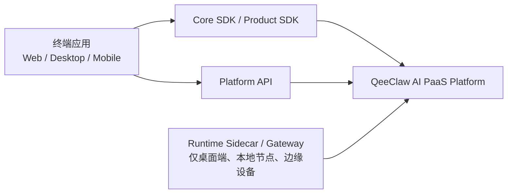
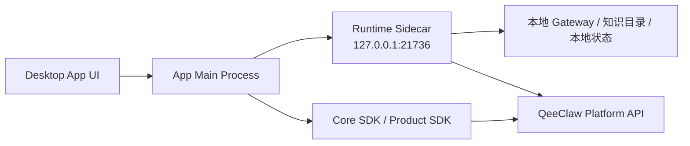

# QeeClaw 终端接入指南

最后更新：2026-04-08

## 1. 文档定位

本文档把原来的：

- Web 对接文档
- 桌面 App 对接文档
- 移动端 App 对接文档

统一收口为一份客户可直接使用的终端接入指南。

适用对象：

- Web 控制台 / 驾驶舱团队
- Electron / Tauri 桌面端团队
- React Native / Expo / Flutter / 原生移动端团队
- 需要判断是否引入 `runtime-sidecar` 的客户

---

## 2. 先做一个接入方式判断

| 终端类型 | 默认推荐方案 | 是否需要 `runtime-sidecar` |
| --- | --- | --- |
| Web 控制台 / 管理后台 / 驾驶舱 | `@qeeclaw/core-sdk` + 可选 `@qeeclaw/product-sdk` | 否 |
| 桌面 App，仅云端能力 | `@qeeclaw/core-sdk` + 可选 `@qeeclaw/product-sdk` | 否 |
| 桌面 App，需要本地知识目录 / 本地 gateway / 本地审批缓存 | `core-sdk` + 可选 `product-sdk` + `runtime-sidecar` | 是 |
| React Native / Expo | `@qeeclaw/core-sdk` + 可选 `@qeeclaw/product-sdk` | 否 |
| iOS / Android 原生 / Flutter | 直接对接 `Platform API` | 否 |

快速判断规则：

- 只接云端平台能力，通常不需要 `runtime-sidecar`
- 只有桌面端、本地节点、边缘设备场景，才应该评估 `runtime-sidecar`
- 移动端当前不应直接依赖 `runtime-sidecar`

---

## 3. 统一架构理解



一句话理解：

- Web / 移动端通常直接对接 `QeeClaw Platform`
- 桌面端分两种：
  - 只用云端能力时，和 Web 类似
  - 需要本地能力时，再引入 `runtime-sidecar`

---

## 4. Web 接入

### 4.1 适用场景

- 官网控制台
- 管理后台
- Web 驾驶舱
- CRM / 客服 / 销售工作台

### 4.2 推荐方案

- 基础能力层：`@qeeclaw/core-sdk`
- 页面装配层：可选 `@qeeclaw/product-sdk`

一般不推荐 Web 直接接 `runtime-sidecar`，因为：

- Sidecar 是本地运行时
- 默认只监听 `127.0.0.1`
- 适合同机桌面端访问，不适合浏览器页面

### 4.3 两种典型模式

1. 前端直连平台  
   适合内部控制台、已有统一登录体系的页面
2. 前端通过 BFF / 网关转发  
   适合公开互联网场景、需要更严格权限裁剪的系统

### 4.4 Web 最小初始化

```ts
import { createQeeClawClient } from "@qeeclaw/core-sdk";
import { createQeeClawProductSDK } from "@qeeclaw/product-sdk";

const apiKey = "sk-your-api-key";

const core = createQeeClawClient({
  baseUrl: import.meta.env.VITE_QEECLAW_BASE_URL || "https://paas.qeeshu.com",
  token: apiKey,
});

const product = createQeeClawProductSDK(core);
```

如果当前接的是 QeeClaw 正式线上环境，前端默认可直接使用：

```text
https://paas.qeeshu.com
```

### 4.5 Web 侧建议

- 面向前端客户交付时，优先使用平台发放的 `API Key`
- 不建议浏览器长期持有管理员级 token / key
- 不建议把模型 provider 密钥管理放在纯前端
- 不建议把本地设备能力直接暴露给浏览器

---

## 5. 桌面端接入

### 5.1 适用场景

- Electron App
- Tauri App
- 本地知识目录协同
- 本地 gateway 托管
- 本地记忆 / 本地审批缓存

### 5.2 两种模式

#### 模式 A：仅云端能力

适合：

- 只需要模型、设备、会话、治理等云端能力
- 不访问本地知识目录
- 不管理本地 gateway

推荐组件：

- `@qeeclaw/core-sdk`
- 可选 `@qeeclaw/product-sdk`

#### 模式 B：本地协同模式

适合：

- 需要本地知识目录扫描
- 需要本地记忆能力
- 需要启动 / 停止本地 gateway
- 需要设备 bootstrap 与本地审批缓存

推荐组件：

- `@qeeclaw/runtime-sidecar`
- `@qeeclaw/core-sdk`
- 可选 `@qeeclaw/product-sdk`

### 5.3 本地协同模式架构



### 5.4 什么时候一定不要引入 Sidecar

- 只是做云端数据看板
- 不读本地目录
- 不管理本地 gateway
- 不需要本地审批 / 设备自举能力

---

## 6. 移动端接入

### 6.1 适用场景

- iOS App
- Android App
- React Native / Expo
- Flutter

### 6.2 推荐方案

- React Native / Expo：优先使用 `@qeeclaw/core-sdk`，可选 `@qeeclaw/product-sdk`
- iOS / Android 原生 / Flutter：直接对接 `Platform API`

### 6.3 为什么移动端不推荐直接接 Sidecar

因为当前 `runtime-sidecar` 的定位是：

- 本地运行时
- 默认监听 `127.0.0.1`
- 与桌面端 / 本地节点同机工作

这意味着：

- 手机上的 `127.0.0.1` 只是手机自己
- 它不是用户 Mac 上的 `127.0.0.1`
- 当前实现也没有把 Sidecar 作为公网服务暴露出去

### 6.4 移动端正确理解方式

移动端当前应优先把 QeeClaw 当成“云端平台能力”来接：

- 手机 App -> QeeClaw 控制面
- 桌面设备 / 本地节点 -> Sidecar / Gateway
- 二者通过平台控制面协同

---

## 7. 终端通用鉴权建议

| 场景 | 推荐凭证 |
| --- | --- |
| Web 控制台 / 会话 / 渠道 / 审批 / 审计 | API Key 或用户登录态 token |
| 模型 / 知识 / 记忆 / 策略检查 | API Key、用户 token 或 LLM Key |
| 桌面端本地 Sidecar HTTP | `sidecar-token` |

统一约定：

```http
Authorization: Bearer <token>
```

---

## 8. 项目里要不要引入 Product SDK

建议规则：

- 如果你只是接平台能力，用 `Core SDK`
- 如果你要快速做工作台、驾驶舱、中心页，再补 `Product SDK`
- `Product SDK` 不是 UI 组件库，而是页面装配层

---

## 9. 客户最常见的三种交付组合

### 9.1 Web 客户端

- `@qeeclaw/core-sdk`
- 可选 `@qeeclaw/product-sdk`

### 9.2 桌面端本地协同项目

- `@qeeclaw/core-sdk`
- 可选 `@qeeclaw/product-sdk`
- `@qeeclaw/runtime-sidecar`
- `sdk/deploy/` 中的 gateway / env / nginx 模板

### 9.3 移动端项目

- JS 移动端：`@qeeclaw/core-sdk`
- 原生移动端：直接对接 `Platform API`

---

## 10. 关联文档

- [QeeClaw_第三方SDK与Platform_API对接文档_20260404.md](./QeeClaw_第三方SDK与Platform_API对接文档_20260404.md)
- [QeeClaw_Platform_API_v1_域化接口说明_20260321.md](./QeeClaw_Platform_API_v1_域化接口说明_20260321.md)
- [QeeClaw_AI_PaaS平台交付手册.md](./QeeClaw_AI_PaaS平台交付手册.md)
