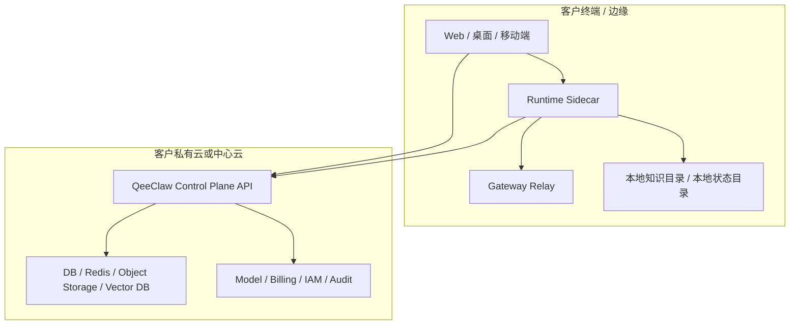

# QeeClaw AI PaaS 私有化部署说明

最后更新：2026-03-22

## 1. 说明范围

本文档说明的是：

- QeeClaw 在私有化或半私有化项目中的推荐部署方式
- `sdk/` 这一层在私有化交付中的角色
- Gateway / Sidecar / SDK 的交付方法

需要特别说明：

**`sdk/` 不是完整控制面部署仓。**

完整私有化项目仍需要主平台仓中的：

- 后端 API
- 控制台或管理后台
- MySQL / Redis
- 对象存储
- 向量存储
- 日志与监控体系

## 2. 三种推荐部署形态

### 2.1 全私有化控制面

适合：

- 政企客户
- 数据必须完全留在客户专网
- 需要完整租户、计费、审批、审计闭环

组成：

- 平台控制面全部部署在客户私有云
- 业务应用通过 `core-sdk` / `product-sdk` 接入
- 如有本地节点，再按需部署 `runtime-sidecar`

### 2.2 混合云 + 本地边缘

适合：

- 核心控制面放在中心云
- 本地仍需要知识目录、设备、自主网关或本地缓存

组成：

- 中心云提供 Control Plane API
- 客户现场部署 Gateway / Sidecar
- 终端通过平台控制面统一收口

### 2.3 桌面本地节点

适合：

- 桌面 App
- 客户个人设备上的本地知识目录
- 需要本地认证态、自举、审批缓存

组成：

- 本地运行 `runtime-sidecar`
- 本地托管 gateway / relay
- 云端继续提供控制面能力

## 3. 推荐拓扑



## 4. 私有化交付最少组件

私有化项目至少需要准备以下四层：

### 4.1 控制面

- 平台 API
- 管理控制台
- 鉴权与租户体系
- 审批、审计、策略能力

### 4.2 数据底座

- MySQL
- Redis
- 对象存储
- 向量存储

### 4.3 开放层

- `@qeeclaw/core-sdk`
- `@qeeclaw/product-sdk`

### 4.4 边缘层

- `@qeeclaw/runtime-sidecar`
- Gateway 容器
- Nginx / HTTPS / WSS

## 5. 部署顺序建议

1. 先部署控制面与数据底座
2. 再配置模型密钥、知识存储与租户基础数据
3. 再部署 Gateway / Relay
4. 再配置 Sidecar 或桌面节点
5. 最后接入 `core-sdk` / `product-sdk` 的业务应用

## 6. 当前可直接复用的交付模板

### 6.1 Gateway 容器样例

路径：

- `sdk/deploy/compose/qeeclaw-gateway.compose.example.yml`

适用：

- 边缘网关
- 混合云 relay
- 本地节点托管 gateway

### 6.2 Gateway 反向代理样例

路径：

- `sdk/deploy/nginx/qeeclaw-gateway.conf.example`

适用：

- HTTPS / WSS 对外暴露
- Nginx 统一入口

### 6.3 运行时环境变量模板

路径：

- `sdk/deploy/env/runtime-sidecar.env.example`
- `sdk/deploy/env/gateway-server.env.example`

## 7. 验证命令

建议交付前至少执行以下检查：

```bash
bash scripts/build-qeeclaw-sdk-stack.sh
bash scripts/verify-qeeclaw-sdk-stack.sh
bash scripts/release-qeeclaw-sdk.sh demo
bash scripts/qeeclaw-sidecar.sh selfcheck
```

如果要单独检查本地 Sidecar：

```bash
bash scripts/run-qeeclaw-sidecar-healthcheck.sh
```

## 8. 关于移动端与本地节点

移动端 App 本身通常不直接承担本地节点职责。

如果移动端业务需要读取本地节点能力，建议通过：

- 平台控制面 API
- 已托管的 gateway / relay
- 统一鉴权与策略层

来做能力收口，而不是把移动端直接耦合到客户个人设备内部实现。

## 9. 交付注意事项

- 模板文件中只能保留占位值，不能写入真实密钥
- Gateway Token、模型密钥、数据库密码必须在客户环境单独注入
- Sidecar 当前属于增强层，不应被当作平台主体
- 如果项目只需要云端 API，不要默认引入 Sidecar

## 10. 关联文档

- `sdk/docs/QeeClaw_AI_PaaS平台交付手册.md`
- `sdk/docs/QeeClaw_AI_PaaS安装升级与迁移说明.md`
- `sdk/docs/QeeClaw_AI_PaaS环境变量模板说明.md`
- `data/docs/技术/saas_gateway_deployment.md`
- `data/docs/运维/gateway_build_deploy.md`
