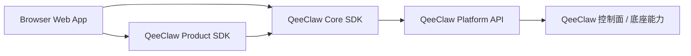
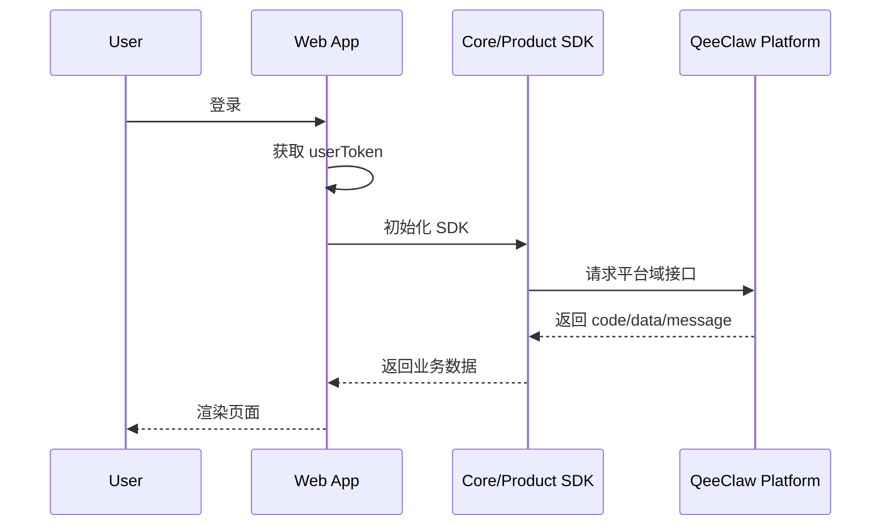

# QeeClaw SDK Web 对接文档

最后更新：2026-03-22

## 1. 适用范围

本文档适用于：

- 官网控制台
- 管理后台
- Web 驾驶舱
- CRM / 秘书 / 客服类 Web 工作台
- 需要通过浏览器访问 QeeClaw 平台能力的前端项目

## 2. Web 场景推荐方案

Web 场景优先推荐：

- 基础能力层：`@qeeclaw/core-sdk`
- 页面装配层：`@qeeclaw/product-sdk`

一般不推荐 Web 直接接 `Runtime Sidecar`，因为：

- Sidecar 是本地运行时
- 默认只监听 `127.0.0.1`
- 适合桌面端同机访问，不适合浏览器页面

## 3. 推荐架构



## 4. 两种接入模式

### 4.1 前端直连平台

适合：

- 内部控制台
- 已有统一登录体系
- 使用普通用户 token 即可完成访问的页面

特点：

- 接入快
- 架构简单
- 前端直接使用 SDK 即可

### 4.2 前端通过 BFF / 网关转发

适合：

- 官网
- 对安全边界要求更高的业务系统
- 不希望浏览器直接暴露过多平台域访问范围

特点：

- 更容易做权限裁剪
- 更容易做聚合缓存
- 更适合公开互联网访问场景

## 5. 安装方式

```bash
pnpm add @qeeclaw/core-sdk @qeeclaw/product-sdk
```

## 6. 最小初始化

```ts
import { createQeeClawClient } from "@qeeclaw/core-sdk";
import { createQeeClawProductSDK } from "@qeeclaw/product-sdk";

const core = createQeeClawClient({
  baseUrl: import.meta.env.VITE_QEECLAW_BASE_URL,
  token: userToken,
});

const product = createQeeClawProductSDK(core);
```

建议环境变量：

```bash
VITE_QEECLAW_BASE_URL=https://your-qeeclaw-host
```

## 7. Web 最常见的对接方式

### 7.1 驾驶舱 / 工作台首页

优先使用 `product-sdk`：

```ts
const governanceHome = await product.governanceCenter.loadHome("mine");
const deviceOverview = await product.deviceCenter.loadOverview();
const knowledgeHome = await product.knowledgeCenter.loadHome({ teamId: 10001 });
```

适合：

- 首页卡片
- 驾驶舱概览
- 中心页首屏

### 7.2 明确的业务动作页

优先使用 `core-sdk`：

```ts
const groups = await core.conversations.listGroups({
  teamId: 10001,
  limit: 20,
});

const result = await core.knowledge.search({
  teamId: 10001,
  query: "安装指南",
  limit: 5,
});
```

适合：

- 会话页
- 知识搜索页
- 模型配置页
- 设备管理页

## 8. 常见页面推荐模块

| 页面类型 | 推荐模块 |
| --- | --- |
| 渠道中心 | `product.channelCenter` 或 `core.channels` |
| 会话中心 | `product.conversationCenter` 或 `core.conversations` |
| 设备中心 | `product.deviceCenter` 或 `core.devices` |
| 知识中心 | `product.knowledgeCenter` 或 `core.knowledge` |
| 治理中心 | `product.governanceCenter`、`core.approval`、`core.audit` |
| 模型页 | `core.models` |

## 9. 鉴权建议

Web 端建议优先使用用户登录态 token：

```http
Authorization: Bearer <user-token>
```

原因：

- `devices / channels / conversations / audit` 更适合账号态访问
- 审批处理和治理中心通常需要账号权限语义
- 用户 token 更适合和浏览器登录态联动

不建议在浏览器端长期暴露高权限管理凭证。

## 10. Web 端不建议直接做的事

- 不建议浏览器直接持有管理员级 token
- 不建议浏览器直接暴露本地 Sidecar 地址
- 不建议把模型 provider 的密钥管理逻辑放到纯前端
- 不建议让浏览器承担设备配对后的本地运行时职责

## 11. CORS 与部署建议

如果是 Web 直连平台，需要确认：

- 平台已配置允许当前前端域名跨域
- 浏览器端能安全获取和刷新登录态 token
- 不涉及必须隐藏在服务端的敏感凭证

如果以上任一项不满足，建议走 BFF。

## 12. 典型接入流程



## 13. 推荐最小代码结构

```ts
// lib/qeeclaw.ts
import { createQeeClawClient } from "@qeeclaw/core-sdk";
import { createQeeClawProductSDK } from "@qeeclaw/product-sdk";

export function createQeeClawSdk(token: string) {
  const core = createQeeClawClient({
    baseUrl: import.meta.env.VITE_QEECLAW_BASE_URL,
    token,
  });

  const product = createQeeClawProductSDK(core);

  return { core, product };
}
```

## 14. 推荐落地顺序

1. 先接 `core-sdk`，把鉴权和基础接口跑通
2. 再接 `product-sdk`，快速生成工作台聚合页
3. 最后按页面细化，逐步下沉到具体模块方法

## 15. Web 场景总结

一句话建议：

- Web 对接，优先把 QeeClaw 当成“平台控制面”
- 用 `core-sdk` 做标准访问
- 用 `product-sdk` 做业务首页装配
- 不把本地 Sidecar 当成浏览器依赖
