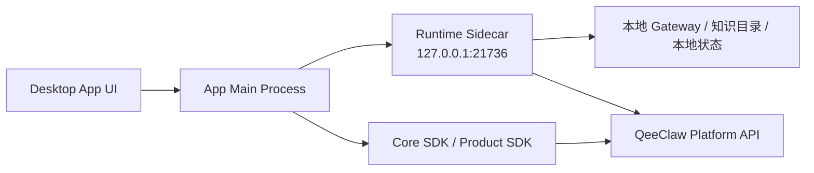
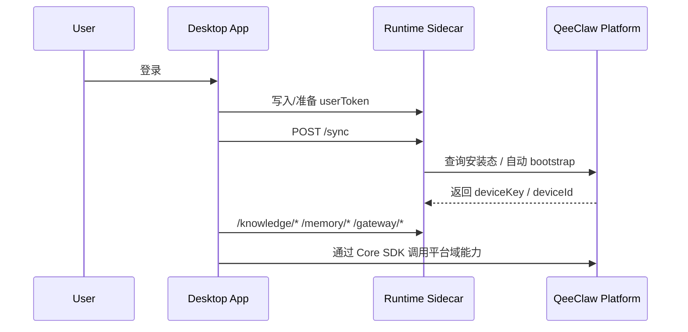

# QeeClaw SDK 桌面 App 对接文档

最后更新：2026-03-22

## 1. 适用范围

本文档适用于：

- Electron App
- Tauri App
- 基于 Node 运行时的桌面客户端
- 需要与客户本地 gateway / 本地知识目录 / 本地状态协同的桌面程序

## 2. 桌面端推荐方案

桌面端有两种推荐模式：

### 模式 A：云端能力模式

适合：

- 只需要平台会话、模型、设备、治理等云端能力
- 不需要访问本地知识目录
- 不需要管理本地 gateway

推荐组件：

- `@qeeclaw/core-sdk`
- `@qeeclaw/product-sdk`

### 模式 B：本地协同模式

适合：

- 需要本地知识目录扫描
- 需要本地记忆能力
- 需要启动/停止本地 gateway
- 需要设备自举和本地审批缓存

推荐组件：

- `@qeeclaw/runtime-sidecar`
- `@qeeclaw/core-sdk`
- 可选 `@qeeclaw/product-sdk`

## 3. 推荐架构



## 4. 为什么桌面端适合接 Sidecar

因为桌面端与 Sidecar 可以部署在同一台机器上：

- 可以访问同机 `127.0.0.1`
- 可以访问本地文件目录
- 可以管理本地 gateway 进程
- 可以维护本地认证态和设备态

这正是 `runtime-sidecar` 的目标场景。

## 5. 安装方式

### 5.1 仅云端能力

```bash
pnpm add @qeeclaw/core-sdk @qeeclaw/product-sdk
```

### 5.2 含本地协同能力

```bash
pnpm add @qeeclaw/core-sdk @qeeclaw/product-sdk @qeeclaw/runtime-sidecar
```

## 6. 模式 A：仅云端能力接入

```ts
import { createQeeClawClient } from "@qeeclaw/core-sdk";
import { createQeeClawProductSDK } from "@qeeclaw/product-sdk";

const core = createQeeClawClient({
  baseUrl: "https://your-qeeclaw-host",
  token: userToken,
});

const product = createQeeClawProductSDK(core);

const deviceOverview = await product.deviceCenter.loadOverview();
const conversationHome = await product.conversationCenter.loadHome(10001);
```

适合：

- 桌面控制台
- 云端数据面板
- 不涉及本地资源的业务页

## 7. 模式 B：本地协同模式接入

### 7.1 启动 Sidecar

```ts
import { createRuntimeSidecar } from "@qeeclaw/runtime-sidecar";

const sidecar = createRuntimeSidecar({
  controlPlaneBaseUrl: "https://your-qeeclaw-host",
  localGatewayWsUrl: "ws://127.0.0.1:18789",
  sidecarHost: "127.0.0.1",
  sidecarPort: 21736,
  sidecarAuthToken: process.env.QEECLAW_SIDECAR_AUTH_TOKEN,
  startGatewayOnBoot: false,
  autoBootstrapDevice: true,
  stateRootDir: "/Users/demo/.qeeclaw",
  stateFilePath: "/Users/demo/.qeeclaw/auth-state.json",
  gatewayCommand: "node",
  gatewayArgs: ["/path/to/local-gateway.js"],
  gatewayWorkingDir: "/path/to",
  gatewayPidFilePath: "/Users/demo/.qeeclaw/sidecar/gateway-adapter.json",
  knowledgeConfigFilePath: "/Users/demo/.qeeclaw/sidecar/knowledge-worker.json",
  approvalsCacheFilePath: "/Users/demo/.qeeclaw/sidecar/approval-agent.json",
  deviceName: "Sales Desktop",
  hostname: "sales-mac",
  osInfo: "macOS 15.3",
});

await sidecar.start();
const sidecarToken = await sidecar.getLocalApiToken();
```

### 7.2 调用本地 Sidecar

```ts
const syncResult = await fetch("http://127.0.0.1:21736/sync", {
  method: "POST",
  headers: {
    Authorization: `Bearer ${sidecarToken}`,
  },
}).then((r) => r.json());

const knowledgeConfig = await fetch("http://127.0.0.1:21736/knowledge/config", {
  headers: {
    Authorization: `Bearer ${sidecarToken}`,
  },
}).then((r) => r.json());
```

说明：

- 本地 HTTP API 默认要求 `Authorization: Bearer <sidecar-token>`
- 推荐桌面 App 显式传入 `sidecarAuthToken`
- 如果不显式传入，Sidecar 会自动生成并持久化一个本地 token
- 默认只允许监听 `127.0.0.1 / localhost / ::1`

### 7.3 同时保留云端 SDK

```ts
import { createQeeClawClient } from "@qeeclaw/core-sdk";

const core = createQeeClawClient({
  baseUrl: "https://your-qeeclaw-host",
  token: userToken,
});

const models = await core.models.listAvailable();
```

## 8. 推荐职责拆分

### 8.1 桌面 App

负责：

- 登录
- 页面展示
- 业务交互
- 通过 `core-sdk` 获取云端数据
- 通过本地 HTTP 调 Sidecar

### 8.2 Sidecar

负责：

- 设备自举
- 本地认证态同步
- 本地知识目录扫描
- 本地记忆访问
- 本地策略检查
- 本地审批缓存
- 本地 Gateway 管理

## 9. 典型接入流程



## 10. 鉴权建议

桌面端通常同时有两类凭证：

- `userToken`
  适合云端控制面能力
- `deviceKey`
  适合设备态、本地节点态、Sidecar 同步后的能力访问

建议：

- `core-sdk` 默认用 `userToken`
- `sidecar` 自己维护 `userToken / deviceKey` 的切换与回写
- `sidecar` 本地 HTTP API 自己维护独立的 `sidecar-token`

## 11. 桌面端推荐的工程结构

```text
desktop-app/
  src/
    main/
      qeeclaw/
        sidecar.ts
        qeeclaw-client.ts
    renderer/
      pages/
      components/
      stores/
```

建议：

- Sidecar 启停和本地文件访问尽量放在主进程
- 渲染层通过 IPC 调主进程
- 不建议让渲染层直接读写本地认证文件

## 12. 当前边界

- `runtime-sidecar` 当前更偏参考实现，不是完整桌面框架
- Sidecar 默认监听 `127.0.0.1`，不建议直接开放到局域网或公网
- 如果你的桌面 App 不是同机部署，就不要把 Sidecar 当成远程服务

## 13. 什么时候不需要 Sidecar

如果你的桌面 App：

- 不需要本地知识目录
- 不需要管理本地网关
- 不需要设备态同步

那就直接使用：

- `core-sdk`
- `product-sdk`

即可。

## 14. 桌面端总结

一句话建议：

- 桌面端如果只做云端页面，接 `core-sdk + product-sdk`
- 桌面端如果要吃本地能力，再加 `runtime-sidecar`
- Sidecar 只应被当成“同机本地运行时”，不要当远程通用网关
