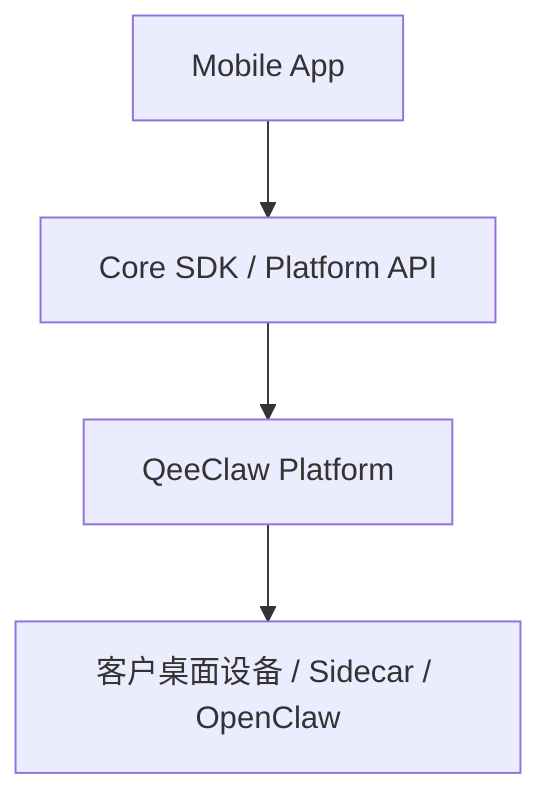
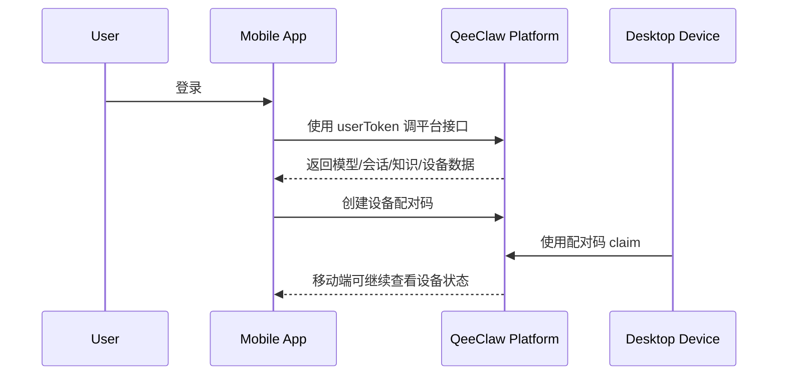

# QeeClaw SDK 移动端 App 对接文档

最后更新：2026-03-22

## 1. 适用范围

本文档适用于：

- iOS App
- Android App
- React Native / Expo App
- Flutter App
- 销售超级驾驶舱等移动端业务应用

## 2. 移动端总体建议

移动端应优先把 QeeClaw 当成“云端平台能力”来接，而不是当成本地 SDK 来接。

推荐方案：

- React Native / Expo：
  优先使用 `@qeeclaw/core-sdk`，可选 `@qeeclaw/product-sdk`
- iOS 原生 / Android 原生 / Flutter：
  直接对接 `QeeClaw Platform API`

当前不推荐移动端直接依赖 `@qeeclaw/runtime-sidecar`。

## 3. 为什么移动端不推荐直接接 Sidecar

因为当前 `runtime-sidecar` 的定位是：

- 本地运行时
- 默认监听 `127.0.0.1`
- 与桌面/本地节点同机工作

这意味着：

- 手机上的 `127.0.0.1` 只是手机自己
- 它不是用户 Mac 上的 `127.0.0.1`
- 当前实现也没有把 Sidecar 作为公网服务暴露出去

所以，移动端当前推荐的标准接法是：

- 手机 App -> QeeClaw 控制面
- 客户本地桌面设备 -> Runtime Sidecar / OpenClaw
- 二者通过平台控制面协同

## 4. 推荐架构



## 5. 两种移动端接入方式

### 5.1 JS 移动端

适合：

- React Native
- Expo
- 其他具备 `fetch / Blob / FormData` 的 JS 运行时

推荐：

- `@qeeclaw/core-sdk`
- 可选 `@qeeclaw/product-sdk`

### 5.2 原生移动端

适合：

- Swift / Kotlin / Java
- Flutter / Dart

推荐：

- 直接按 `Platform API` 接口对接
- 把 `Core SDK` 作为接口设计参考，而不是运行时依赖

## 6. React Native 最小示例

```ts
import { createQeeClawClient } from "@qeeclaw/core-sdk";
import { createQeeClawProductSDK } from "@qeeclaw/product-sdk";

const core = createQeeClawClient({
  baseUrl: "https://your-qeeclaw-host",
  token: userToken,
});

const product = createQeeClawProductSDK(core);

const models = await core.models.listAvailable();
const deviceOverview = await product.deviceCenter.loadOverview();
const conversationHome = await product.conversationCenter.loadHome(10001);
```

## 7. 移动端最适合接的能力

移动端推荐优先使用这些云端能力：

- `devices`
- `models`
- `channels`
- `conversations`
- `knowledge`
- `approval`
- `audit`

对应典型页面：

| 页面类型 | 推荐能力 |
| --- | --- |
| 销售驾驶舱首页 | `product.governanceCenter`、`product.deviceCenter` |
| 客户会话列表 | `core.conversations` |
| 知识检索 | `core.knowledge` |
| 模型切换 / 轻量调用 | `core.models` |
| 设备状态查看 | `core.devices` |
| 审批中心 | `core.approval` |

## 8. 移动端与桌面设备的协同方式

移动端不要直接访问桌面端本地 Sidecar。

推荐协同方式：

### 8.1 设备配对

移动端可以使用用户 token 调用：

- `POST /api/platform/devices/pair-code`

由桌面端设备去完成：

- `POST /api/platform/devices/claim`

这样移动端可以发起配对，桌面端完成认领。

### 8.2 设备查看

移动端再通过：

- `GET /api/platform/devices`
- `GET /api/platform/devices/account-state`

查看当前设备状态。

### 8.3 云端协同

移动端所有业务操作尽量通过平台控制面完成，不直接和用户 Mac 的本地服务互连。

## 9. 典型移动端接入流程



## 10. 移动端当前不建议的方案

- 不建议移动端直接调用桌面端 `127.0.0.1`
- 不建议移动端依赖 `runtime-sidecar`
- 不建议把桌面设备上的本地目录当成移动端直接可读资源
- 不建议让手机与客户个人 Mac 建立“必须直连才能工作”的产品架构

## 11. 如果必须访问本地桌面能力怎么办

当前代码落地层面，推荐做法仍然是：

- 本地桌面设备通过 Sidecar 接入平台
- 移动端通过平台控制面访问设备相关能力

如果未来确实要让移动端直接访问客户本地 Mac，需要额外建设：

- 公网可达的设备接入层
- 安全认证与设备寻址能力
- 端到端网络连通机制

这些都不属于当前 SDK 已落地能力范围。

## 12. 原生移动端对接建议

如果是原生 iOS / Android / Flutter：

- 当前可直接按 `Platform API` 对接
- 建议把 `Core SDK` 的模块划分作为 API 分组参考
- 认证、分页、错误处理按平台统一约定实现

建议优先封装本地移动端自己的 service 层：

- `deviceService`
- `conversationService`
- `knowledgeService`
- `governanceService`

## 13. 移动端总结

一句话建议：

- 移动端把 QeeClaw 当成“云平台能力”来接
- JS 移动端可以直接接 `core-sdk`
- 原生移动端直接接 `Platform API`
- 当前不要把 `runtime-sidecar` 作为移动端直接依赖
