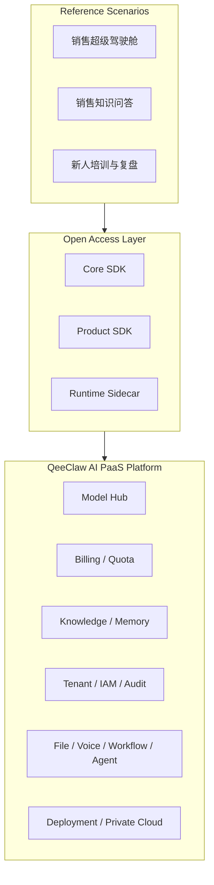

# QeeClaw SDK 通用说明

最后更新：2026-03-22

## 1. 文档目的

本文档用于说明：

1. QeeClaw 平台与 SDK 的关系
2. 当前开放层由哪些组件组成
3. 不同团队应该如何选择接入方式
4. 为什么“销售超级驾驶舱”会成为第一样板场景

本文档的核心前提是：

**QeeClaw 是 AI PaaS 平台，SDK 是它的标准开放接入层，而不是反过来。**

## 2. 先理解平台，再理解 SDK

QeeClaw 平台本身承担的是企业级 AI 后端基础设施能力，包括：

- 模型管理与路由
- Token / 计费 / 配额
- 知识与检索
- 记忆与上下文
- 权限、审批与审计
- 文件、语音、工作流、Agent
- 私有化部署与边缘节点协作

SDK 的作用，是把这些平台能力按稳定方式开放给：

- Web 应用
- 桌面 App
- 移动端
- 业务集成系统
- 行业方案与二开团队

## 3. 当前开放层概览

当前开放层分为三层主组件，加一个硬件样例层：

### 3.1 Core SDK

- 包名：`@qeeclaw/core-sdk`
- 角色：平台标准 API 访问层
- 作用：把平台域能力封装成稳定调用接口

### 3.2 Product SDK

- 包名：`@qeeclaw/product-sdk`
- 角色：场景 / 产品装配层
- 作用：把多个平台接口装配成中心页、驾驶舱、行业首页数据入口

### 3.3 Runtime Sidecar

- 包名：`@qeeclaw/runtime-sidecar`
- 角色：本地运行时适配层
- 作用：承接桌面端、本地节点、边缘设备所需的本地能力

### 3.4 Meeting Device Firmware

- 目录：`sdk/meeting_device_firmware`
- 角色：硬件接入样例层
- 作用：说明设备如何接入平台能力

## 4. 总体架构图



## 5. 三类开放层分别承担什么

### 5.1 Core SDK

当前职责：

- 统一访问平台域接口
- 统一 Bearer 鉴权
- 提供稳定模块化调用入口
- 降低业务系统直接拼 URL 的成本

当前已开放模块：

- `file`
- `voice`
- `workflow`
- `agent`
- `billing`
- `iam`
- `apikey`
- `tenant`
- `devices`
- `models`
- `channels`
- `conversations`
- `memory`
- `knowledge`
- `policy`
- `approval`
- `audit`

下一阶段应优先补齐：

- `tenant / iam` 的完整控制面
- 更成熟的运行时治理与编排能力
- 更强的平台交付与私有化资产

适合：

- Web 前端
- Node 服务端
- Electron / Tauri 桌面应用
- React Native / Expo 等 JS 运行环境

### 5.2 Product SDK

当前职责：

- 不是 UI 组件库
- 是平台能力的场景装配层
- 把多个底层接口整理为可直接消费的数据入口

当前通用 kit：

- `channelCenter`
- `conversationCenter`
- `deviceCenter`
- `knowledgeCenter`
- `governanceCenter`

当前已落地的第一样板场景 kit：

- `salesCockpit`
- `salesKnowledge`
- `salesCoaching`

适合：

- 驾驶舱
- 工作台首页
- 行业业务首页
- 销售赋能场景

### 5.3 Runtime Sidecar

当前职责：

- 本地认证态同步
- 本地知识目录扫描
- 本地记忆访问
- 本地策略检查与审批缓存
- 本地 Gateway 管理

当前本地 HTTP 能力：

- `/health`
- `/state`
- `/sync`
- `/gateway/*`
- `/memory/*`
- `/knowledge/*`
- `/policy/*`
- `/approvals/*`

它的正确理解方式是：

**可选增强层，而不是平台主体。**

适合：

- 桌面 App
- 本地代理程序
- 客户本地设备节点
- 私有化边缘能力承载

不适合：

- 纯浏览器页面
- 纯移动端 App
- 没有本机运行环境的远程前端

## 6. 第一样板场景：销售超级驾驶舱

### 6.1 为什么是它

根据平台路线图，第一阶段不应平均发力，而应围绕真实业务场景打透。

当前最适合的第一样板场景是：

**销售超级驾驶舱**

它能够同时牵引以下平台能力成熟：

- 销售知识问答
- 销售会话复盘
- 风险商机提醒
- 新人培训与辅导
- 审批、治理与计费可视化

### 6.2 它在开放层中的位置

销售超级驾驶舱不应直接写死在平台层，而应位于：

- 平台之上
- Product SDK 之中
- 作为第一参考应用形态

### 6.3 它将如何影响 SDK 演进

它将推动：

- Core SDK 继续深化 `tenant / iam` 与运行时治理能力
- Product SDK 继续打磨 `sales-*` 场景 kit 的字段与装配稳定性
- 平台文档从“通用能力介绍”走向“样板场景闭环”

## 7. 组件选择建议

| 场景 | 推荐组件 | 说明 |
| --- | --- | --- |
| Web 控制台 / 销售超级驾驶舱 | `core-sdk` + `product-sdk` | 直接对接平台控制面 |
| 桌面 App，仅云端能力 | `core-sdk` + `product-sdk` | 与 Web 接法类似 |
| 桌面 App，需要本地知识/本地网关 | `runtime-sidecar` + `core-sdk` | Sidecar 承接本地能力，Core SDK 承接平台能力 |
| React Native / Expo | `core-sdk`，可选 `product-sdk` | 前提是运行环境具备 `fetch / FormData / Blob` |
| iOS / Android 原生 / Flutter | 直接接 `Platform API` | 当前仓库没有原生移动 SDK |
| 设备 / 硬件接入 | `meeting_device_firmware` + Platform API | 作为硬件接入样例 |

## 8. 鉴权说明

统一采用：

```http
Authorization: Bearer <token>
```

当前支持的 Bearer 形态：

- 用户登录态 token
- LLM Key
- 少数兼容场景下的 AppKey

推荐使用方式：

- `devices / channels / conversations / audit / approval.resolve`
  优先使用用户登录态 token
- `models / memory / policy / approval.request / approval.list / approval.get`
  可使用用户 token，部分场景也可使用设备 key / LLM Key

## 9. 返回格式

平台接口统一优先返回：

```json
{
  "code": 0,
  "data": {},
  "message": "success"
}
```

说明：

- `code === 0` 表示成功
- SDK 侧会将部分字段从 `snake_case` 映射为更稳定的调用对象

## 10. 最小接入示例

### 10.1 Core SDK

```ts
import { createQeeClawClient } from "@qeeclaw/core-sdk";

const client = createQeeClawClient({
  baseUrl: "https://your-qeeclaw-host",
  token: "your-bearer-token",
});

const models = await client.models.listAvailable();
const devices = await client.devices.list();
```

### 10.2 Product SDK

```ts
import { createQeeClawClient } from "@qeeclaw/core-sdk";
import { createQeeClawProductSDK } from "@qeeclaw/product-sdk";

const core = createQeeClawClient({
  baseUrl: "https://your-qeeclaw-host",
  token: "your-bearer-token",
});

const product = createQeeClawProductSDK(core);

const governanceHome = await product.governanceCenter.loadHome("mine");
const knowledgeHome = await product.knowledgeCenter.loadHome({ teamId: 1 });
```

### 10.3 Runtime Sidecar

```ts
import { createRuntimeSidecar } from "@qeeclaw/runtime-sidecar";

const sidecar = createRuntimeSidecar({
  controlPlaneBaseUrl: "https://your-qeeclaw-host",
  localGatewayWsUrl: "ws://127.0.0.1:18789",
  sidecarHost: "127.0.0.1",
  sidecarPort: 21736,
  sidecarAuthToken: process.env.QEECLAW_SIDECAR_AUTH_TOKEN,
  startGatewayOnBoot: false,
  autoBootstrapDevice: true,
});

await sidecar.start();
const sidecarToken = await sidecar.getLocalApiToken();
```

## 11. 当前能力边界

- 当前公开 SDK 仍以 TypeScript 为主
- 当前没有独立的 iOS / Android / Flutter 原生 SDK
- `runtime-sidecar` 当前仍更偏本地运行时适配层
- `runtime-sidecar` 的本地 HTTP API 默认需要 `Authorization: Bearer <sidecar-token>`
- 当前 `billing / iam / apikey / file / voice / workflow / agent` 已进入 `core-sdk`
- `tenant` 也已形成“工作空间上下文 + 企业认证”第一版映射，但还不是完整租户控制面
- 如果是多终端协同，推荐通过平台控制面统一收口，而不是让终端直接互连

## 12. 推荐接入顺序

建议所有新团队按下面顺序接入：

1. 先明确自己接的是 QeeClaw 平台，不是单独的 SDK 产品
2. 再确定应用形态：Web、桌面 App、移动端 App
3. 不需要本地运行时能力时，优先接 `core-sdk`
4. 需要场景装配层时，再接 `product-sdk`
5. 只有涉及本地知识目录、本地网关、本地审批缓存时，才引入 `runtime-sidecar`

## 13. 交付与部署资产

为了让 SDK 不只停留在“包可以安装”，当前还同步提供了第一轮平台交付资产：

- `sdk/docs/QeeClaw_AI_PaaS平台交付手册.md`
- `sdk/docs/QeeClaw_AI_PaaS私有化部署说明.md`
- `sdk/docs/QeeClaw_AI_PaaS安装升级与迁移说明.md`
- `sdk/docs/QeeClaw_AI_PaaS环境变量模板说明.md`
- `sdk/docs/QeeClaw_AI_PaaS交付资产清单.md`

模板目录位于：

- `sdk/deploy/env/`
- `sdk/deploy/compose/`
- `sdk/deploy/nginx/`

需要注意：

- `sdk/` 当前承载的是平台开放层与边缘交付样例
- 完整控制面私有化部署仍需要主平台仓中的后端、前端、数据库与存储组件共同交付
